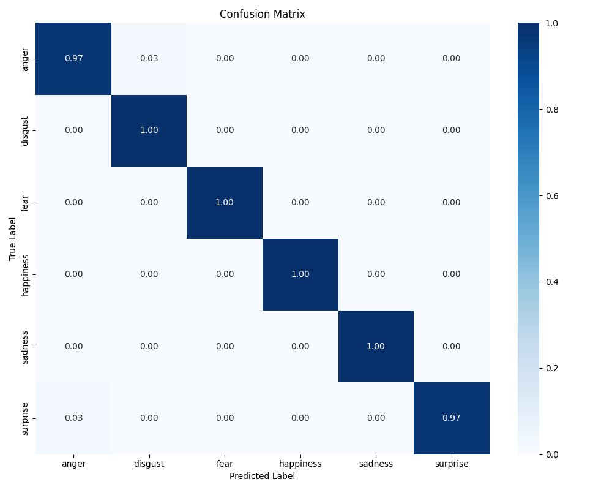
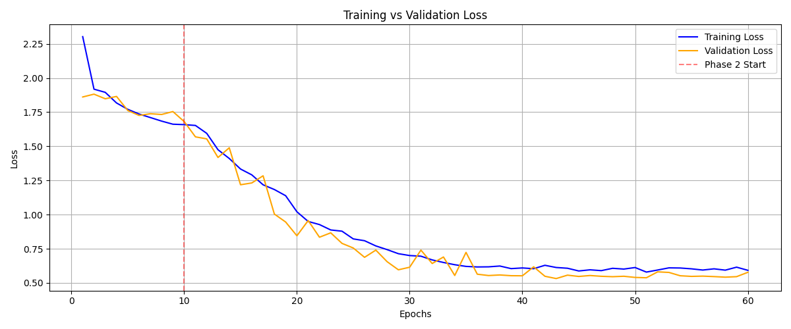

# Driver Facial Expression Recognition

A lightweight driver-emotion classifier built with PyTorch. The model, named **ShuffleEfficientViT**, combines a ShuffleNet V2 CNN branch for local facial features with an EfficientViT-M2 branch for global context. Their feature vectors are fused and classified with a 1x1 convolutional head.

The system predicts six expressions: **anger, disgust, fear, happiness, sadness, and surprise**.

> This repository is an academic project inspired by the ShuffViT-DFER architecture. It is not the official implementation of the referenced paper and is not intended for safety-critical use.

## Highlights

- Dual CNN-transformer architecture with 1,248 fused features
- MTCNN face detection and 224 x 224 aligned face crops
- Two-stage transfer learning: frozen backbones followed by differential fine-tuning
- Class-weighted cross-entropy with label smoothing
- Grad-CAM visualizations for both model branches
- Reported test accuracy of **99.09%** on the project's cropped 80/20 split (217/219 images)

## Results

| Configuration | Accuracy |
| --- | ---: |
| Baseline without face cropping | 88.61% |
| Fine-tuned model with MLP head | 77.94% |
| Fine-tuned model with convolutional head | 90.09% |
| Convolutional head and label smoothing | 91.89% |
| Convolutional head, label smoothing, and cropped faces | **99.09%** |



The final saved classification report contains 219 test images. Fear, happiness, and sadness reached an F1-score of 1.00; the remaining errors were in anger, disgust, and surprise.



## Repository layout

```text
.
|-- engine.py                    # ShuffleEfficientViT model
|-- train_final.py               # Two-stage training loop
|-- cropping.py                  # MTCNN face cropping
|-- dataset_preprocessing_2.py   # 80/20 train-test split
|-- data_transformation_2.py     # Training and test transforms
|-- create_dataloaders_2.py      # PyTorch data loaders
|-- conf_matrix_2.py             # Evaluation and confusion matrix
|-- inference_2.py               # Single-image inference
|-- explain_3.py                 # Branch-specific Grad-CAM
|-- lr_finder.py                 # Learning-rate range test
|-- requirements.txt
`-- docs/images/                  # Curated, non-sensitive result figures
```

Files with earlier experiments or alternative implementations are kept in the working project but are not part of the primary pipeline described above.

## Setup

Python 3.10+ and a CUDA-capable PyTorch installation are recommended. The scripts also fall back to CPU, although training will be considerably slower.

```bash
python -m venv .venv
python -m pip install --upgrade pip
python -m pip install -r requirements.txt
python -m pip install --no-deps facenet-pytorch==2.6.0
```

The pinned `torch` and `torchvision` packages in `requirements.txt` target CUDA 13.0. If that build does not match your system, install the appropriate PyTorch build first and then install the remaining dependencies. `facenet-pytorch` 2.6.0 declares older PyTorch, NumPy, and Pillow version ranges; the command above preserves this project's newer pinned environment, but that combination should be tested on a clean machine before publishing a formal release.

The model backbones use pretrained ImageNet weights, so the first run may download weights from TorchVision and timm.

## Dataset

The project uses the [Keimyung University Facial Expression of Drivers (KMU-FED)](https://cvpr.kmu.ac.kr/KMU-FED.htm) dataset. It contains near-infrared driver images from 12 subjects under varied illumination and partial occlusion.

The dataset is copyrighted by the KMU CVPR Lab and its official page grants free download only for academic research. For that reason, dataset files are intentionally excluded from this repository. Download them from the official page and review its terms before use or redistribution.

Place the downloaded images as follows:

```text
KMU-FED/
|-- 01_AN_...
|-- 01_DI_...
`-- ...
```

Generate face crops and the split dataset:

```bash
python cropping.py
python dataset_preprocessing_2.py
```

This creates:

```text
KMU-FED_Cropped/
dataset_cropped_split/
|-- train/
|   |-- anger/
|   |-- disgust/
|   `-- ...
`-- test/
    |-- anger/
    |-- disgust/
    `-- ...
```

## Training

Run the two-stage training pipeline:

```bash
python train_final.py
```

The default configuration trains only the classification head for 10 epochs and then fine-tunes the complete network for 50 epochs with separate backbone and head learning rates. The best state dictionary is written to `results/best_model.pth`.

Key defaults are defined near the top of `train_final.py`, `create_dataloaders_2.py`, and `data_transformation_2.py`.

## Evaluation

Set `MODEL_PATH` in `conf_matrix_2.py` to the checkpoint you want to evaluate, then run:

```bash
python conf_matrix_2.py
```

The script prints a scikit-learn classification report and saves a normalized confusion matrix.

## Inference

Set `MODEL_PATH` and `IMAGE_PATH` near the top of `inference_2.py`, then run:

```bash
python inference_2.py
```

The script detects the largest face with MTCNN, converts it to three-channel grayscale, predicts the emotion and confidence, and saves `prediction_result.png`.

To inspect the model's attention, set the same paths in `explain_3.py` and run:

```bash
python explain_3.py
```

## Checkpoints

Model checkpoints are intentionally excluded from Git because they are generated binary artifacts and several local copies are duplicates. For a public release, upload only the final checkpoint as a **GitHub Release asset** and document its filename and checksum. Git LFS is another option if the checkpoint must be versioned alongside the source.

## Reproducibility and limitations

- The reported 99.09% accuracy is the result recorded for the project's saved cropped split, not an independently reproduced benchmark.
- `dataset_preprocessing_2.py` performs a random image-level split. Because KMU-FED contains multiple frames per driver, the same subject can appear in both training and test sets. A subject-independent split or cross-validation is recommended for a stronger generalization claim.
- The dataset is small (1,081 successfully cropped images), so performance on unseen drivers and real-world conditions requires further validation.
- Training seeds are set to 42, but the dataset-splitting script currently does not set a random seed. Save split manifests or add a seed before comparing experiments.
- This research prototype must not be used as a driver-safety decision system without broader validation, calibration, and safety engineering.

## References

1. I. Saadi et al., "Shuffle Vision Transformer: Lightweight, Fast and Efficient Recognition of Driver's Facial Expression," *IEEE Transactions on Intelligent Vehicles*, 2024. [Official implementation](https://github.com/Ibtissam-SAADI/ShuffViT-DFER)
2. N. Ma et al., "ShuffleNet V2: Practical Guidelines for Efficient CNN Architecture Design," ECCV, 2018.
3. X. Liu et al., "EfficientViT: Memory Efficient Vision Transformer with Cascaded Group Attention," CVPR, 2023.
4. M. Jeong and B. C. Ko, "Driver's Facial Expression Recognition in Real-Time for Safe Driving," *Sensors*, 2018.

## License

No software license has been selected yet. Add a `LICENSE` file before inviting reuse. The KMU-FED dataset is governed separately by the terms on its official website and is not included here.
